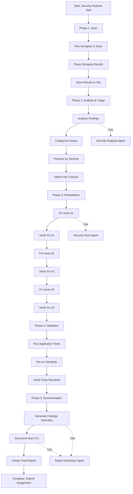

# Week 6-2 Security Analysis & Remediation Plan

## Requirement Specification

### Objective
Perform static analysis using Semgrep on the week6 codebase, triage findings, and remediate at least 3 security issues while ensuring application functionality and tests pass.

### Scope
- **Backend**: Python FastAPI application (`backend/`)
- **Frontend**: JavaScript application (`frontend/`)
- **Tools**: Semgrep (already installed)

### Success Criteria
1. Run Semgrep scan successfully
2. Analyze and categorize all findings (SAST/Secrets/SCA)
3. Fix at least 3 security issues
4. Application runs without errors
5. All tests pass
6. Semgrep re-scan shows fixed issues are resolved
7. Generate comprehensive documentation

---

## Workflow Diagram



---

## Subagents to Create

### 1. `security-analyzer`
**Purpose**: Analyze Semgrep results and categorize security findings

**Capabilities**:
- Parse Semgrep JSON output
- Categorize findings by type (SAST, Secrets, SCA)
- Prioritize by severity (Critical, High, Medium, Low)
- Identify false positives
- Generate triage report

**Input**: Semgrep results file path
**Output**: Triage report with prioritized issues

---

### 2. `security-fixer`
**Purpose**: Fix security vulnerabilities identified by Semgrep

**Capabilities**:
- Analyze specific security issue
- Research best practices for remediation
- Generate secure code fix
- Apply minimal, targeted changes
- Verify fix doesn't break functionality

**Input**: Issue details (file, line, rule, description)
**Output**: Code fix with explanation

---

### 3. `report-generator`
**Purpose**: Generate comprehensive security report documentation

**Capabilities**:
- Compile findings overview
- Document each fix with before/after
- Explain mitigation strategies
- Generate final assignment report

**Input**: Scan results, fix details, verification status
**Output**: Markdown report

---

### 4. `test-runner`
**Purpose**: Run and verify application tests

**Capabilities**:
- Execute backend tests (pytest)
- Verify application runs correctly
- Check for regressions after fixes
- Report test failures

**Input**: Test command
**Output**: Test results and status

---

## Skills to Create

### 1. `scan`
**Purpose**: Run Semgrep security scan

**Usage**: `/scan`

**Behavior**:
- Runs `semgrep ci --subdir week6`
- Saves results to `semgrep-results.json`
- Returns summary of findings

---

### 2. `analyze`
**Purpose**: Analyze Semgrep results and create triage report

**Usage**: `/analyze [results_file]`

**Behavior**:
- Uses `security-analyzer` agent
- Categorizes findings by type
- Prioritizes by severity
- Creates `security-triage-report.md`
- Returns top 3 issues to fix

---

### 3. `fix`
**Purpose**: Fix a specific security issue

**Usage**: `/fix <issue_number>`

**Behavior**:
- Uses `security-fixer` agent
- Applies minimal, targeted fix
- Documents the change
- Returns fix summary

---

### 4. `verify`
**Purpose**: Verify fixes and run tests

**Usage**: `/verify`

**Behavior**:
- Uses `test-runner` agent
- Runs pytest tests
- Re-runs Semgrep scan
- Returns verification status

---

### 5. `report`
**Purpose**: Generate final security report

**Usage**: `/report`

**Behavior**:
- Uses `report-generator` agent
- Compiles all findings and fixes
- Generates `SECURITY_REPORT.md`
- Returns report summary

---

### 6. `full-workflow`
**Purpose**: Run complete security workflow end-to-end

**Usage**: `/workflow`

**Behavior**:
1. Runs Semgrep scan
2. Analyzes results
3. Fixes top 3 issues
4. Verifies fixes
5. Generates final report
6. Returns completion status

---

## Implementation Steps

### Step 1: Create Project Structure
- [ ] Create `.claude/` directory
- [ ] Create `.claude/agents/` subdirectory
- [ ] Create `.claude/skills/` subdirectory

### Step 2: Create Subagents
- [ ] Create `security-analyzer.md`
- [ ] Create `security-fixer.md`
- [ ] Create `report-generator.md`
- [ ] Create `test-runner.md`

### Step 3: Create Skills
- [ ] Create `scan.md`
- [ ] Create `analyze.md`
- [ ] Create `fix.md`
- [ ] Create `verify.md`
- [ ] Create `report.md`
- [ ] Create `full-workflow.md`

### Step 4: Test Workflow
- [ ] Test `/scan` skill
- [ ] Test `/analyze` skill
- [ ] Test `/fix` skill
- [ ] Test `/verify` skill
- [ ] Test `/report` skill
- [ ] Test `/workflow` skill

### Step 5: Execute Assignment
- [ ] Run complete workflow
- [ ] Review generated reports
- [ ] Verify all fixes applied
- [ ] Confirm tests pass
- [ ] Submit assignment

---

## Acceptance Criteria

### Functional Requirements
- [ ] Semgrep scan completes successfully
- [ ] Results saved to `semgrep-results.json`
- [ ] At least 3 security issues are identified
- [ ] All 3 issues are fixed with minimal code changes
- [ ] Fixes use secure coding practices
- [ ] Application runs without errors
- [ ] All existing tests pass
- [ ] Re-scan shows fixed issues are resolved

### Documentation Requirements
- [ ] `security-triage-report.md` generated with:
  - Categories of findings (SAST/Secrets/SCA)
  - Prioritized issue list
  - False positive explanations (if any)
- [ ] Individual fix documentation for each issue:
  - File and line(s)
  - Rule/category Semgrep flagged
  - Risk description
  - Code change (diff)
  - Mitigation explanation
- [ ] Final `SECURITY_REPORT.md` with all findings and fixes

### Code Quality Requirements
- [ ] No new security issues introduced
- [ ] Code follows existing patterns
- [ ] Changes are minimal and targeted
- [ ] No hardcoded values added
- [ ] Proper error handling maintained

### Process Requirements
- [ ] Workflow is reproducible
- [ ] All agents work independently
- [ ] Skills can be invoked individually
- [ ] Full workflow runs end-to-end
- [ ] Error handling at each step

---

## Known Security Issues (Preliminary Analysis)

Based on code review, the following issues are likely to be found:

1. **SQL Injection** (`backend/app/routers/notes.py:71-78`)
   - `unsafe_search` function uses f-string with user input

2. **Command Injection** (`backend/app/routers/notes.py:108-117`)
   - `debug_run` executes user input with `subprocess.run(..., shell=True)`

3. **Arbitrary Code Execution** (`backend/app/routers/notes.py:102-105`)
   - `debug_eval` uses `eval()` with user input

4. **Weak Cryptography** (`backend/app/routers/notes.py:95-99`)
   - `debug_hash_md5` uses MD5 hash

5. **Path Traversal** (`backend/app/routers/notes.py:129-135`)
   - `debug_read` opens arbitrary file paths

6. **CORS Misconfiguration** (`backend/app/main.py:22-28`)
   - `allow_origins=["*"]` allows all origins

7. **XSS Vulnerability** (`frontend/app.js:14`)
   - `innerHTML` with unsanitized user input

---

## File Structure

```
week6-2/
├── .claude/
│   ├── PLAN.md                    # This file
│   ├── agents/
│   │   ├── security-analyzer.md
│   │   ├── security-fixer.md
│   │   ├── report-generator.md
│   │   └── test-runner.md
│   └── skills/
│       ├── scan.md
│       ├── analyze.md
│       ├── fix.md
│       ├── verify.md
│       ├── report.md
│       └── full-workflow.md
├── backend/
├── frontend/
├── assignment.md
└── (existing project files)
```

---

## Next Steps

1. Review this plan and approve structure
2. Execute `/create-agents-and-skills` to implement
3. Run `/workflow` to complete the assignment
4. Review generated reports
5. Submit to Gradescope
