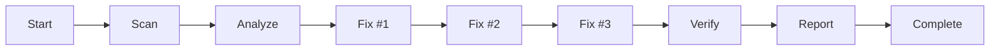

# Full Workflow - Complete Security Analysis & Remediation

## Overview

Runs the entire security analysis and remediation workflow from start to finish, including scanning, analysis, fixing, verification, and reporting.

## Usage

```
/workflow
```

## What It Does

Executes the complete workflow in sequence:

1. **Scan** - Run Semgrep security scan
2. **Analyze** - Categorize and triage findings
3. **Fix** - Apply fixes for top 3 security issues
4. **Verify** - Run tests and re-scan to confirm fixes
5. **Report** - Generate final security report

## Workflow Steps



## Detailed Steps

### Phase 1: Scan
```
Command: semgrep scan
Output: semgrep-results.json
```
- Runs comprehensive security scan
- Identifies all vulnerabilities
- Saves results for analysis

### Phase 2: Analyze
```
Agent: security-analyzer
Output: security-triage-report.md
```
- Categorizes findings (SAST/Secrets/SCA)
- Prioritizes by severity
- Identifies false positives
- Selects top 3 issues to fix

### Phase 3: Fix
```
Agent: security-fixer
Output: security-fix-{1,2,3}.md
```
- Fix Issue #1: SQL Injection or similar
- Fix Issue #2: Command Injection or similar
- Fix Issue #3: XSS or similar
- Each fix includes before/after code and explanation

### Phase 4: Verify
```
Agent: test-runner
Output: test-results.md, updated semgrep-results.json
```
- Run all backend tests
- Verify application starts
- Test key endpoints
- Re-run Semgrep scan
- Confirm all 3 issues resolved

### Phase 5: Report
```
Agent: report-generator
Output: SECURITY_REPORT.md
```
- Compile findings overview
- Document all 3 fixes with before/after
- Add verification results
- Generate final assignment report

## Expected Output

A comprehensive summary including:

```
Starting complete security workflow...

=== Phase 1: Scan ===
✓ Semgrep scan complete
- Total findings: 42
- Critical: 3 | High: 8 | Medium: 18 | Low: 13

=== Phase 2: Analyze ===
✓ Analysis complete
- Categories: SAST (35), Secrets (2), SCA (5)
- False positives: 3
- Top 3 issues prioritized for fixing

=== Phase 3: Fix ===
✓ Fix #1: SQL Injection in notes.py:71
✓ Fix #2: Command Injection in notes.py:108
✓ Fix #3: XSS in app.js:14

=== Phase 4: Verify ===
✓ Tests: 15/15 passed
✓ Application: Running on localhost:8000
✓ Re-scan: All 3 fixed issues resolved

=== Phase 5: Report ===
✓ Final report generated: SECURITY_REPORT.md

=== Complete ===
All phases complete!
- Scan: semgrep-results.json
- Analysis: security-triage-report.md
- Fixes: security-fix-{1,2,3}.md
- Tests: test-results.md
- Report: SECURITY_REPORT.md

Ready for assignment submission!
```

## Generated Files

The workflow creates the following files:

1. `semgrep-results.json` - Semgrep scan results
2. `security-triage-report.md` - Triage analysis
3. `security-fix-1.md` - Fix #1 documentation
4. `security-fix-2.md` - Fix #2 documentation
5. `security-fix-3.md` - Fix #3 documentation
6. `test-results.md` - Test verification results
7. `SECURITY_REPORT.md` - Final assignment report

## Prerequisites

- Semgrep must be installed
- Project dependencies must be installed
- Git repository should be initialized

## Error Handling

If any step fails:
- Stop the workflow
- Report the error
- Suggest next steps
- Option to resume from failed step

## Interactive Mode

The workflow can be run in interactive mode, pausing after each phase for user confirmation:

```
/workflow --interactive
```

This allows you to:
- Review results before proceeding
- Make manual adjustments if needed
- Skip certain phases
- Customize the workflow

## Time Estimates

- **Scan**: 1-2 minutes
- **Analyze**: 30-60 seconds
- **Fix (3 issues)**: 2-3 minutes each
- **Verify**: 1-2 minutes
- **Report**: 30-60 seconds

**Total estimated time**: 10-15 minutes

## Success Criteria

The workflow is considered successful when:
- [ ] Semgrep scan completes without errors
- [ ] Analysis report is generated
- [ ] All 3 security issues are fixed
- [ ] All tests pass
- [ ] Application runs without errors
- [ ] Re-scan shows fixed issues resolved
- [ ] Final report is generated

## Manual Workflow Steps

If you prefer to run each step manually:

```bash
# Step 1: Scan
/scan

# Step 2: Analyze
/analyze

# Step 3: Fix issues
/fix 1
/fix 2
/fix 3

# Step 4: Verify
/verify

# Step 5: Report
/report
```

## Related Commands

- `/scan` - Run just the scan phase
- `/analyze` - Run just the analysis phase
- `/fix` - Fix a specific issue
- `/verify` - Run just the verification phase
- `/report` - Run just the report generation phase

## Tips

1. **Review each phase**: Use interactive mode to review results before proceeding
2. **Customize fixes**: If you want to fix different issues, use `/fix` individually
3. **Skip verification**: If you're confident, you can skip the verify phase (not recommended)
4. **Generate partial report**: You can generate report after any number of fixes

## Submission Checklist

After completing the workflow, before submitting:

- [ ] Review `SECURITY_REPORT.md` for accuracy
- [ ] Ensure all 3 fixes are documented with before/after
- [ ] Verify tests pass in test-results.md
- [ ] Check that re-scan shows issues resolved
- [ ] Commit all changes to git
- [ ] Push to remote repository
- [ ] Submit via Gradescope
